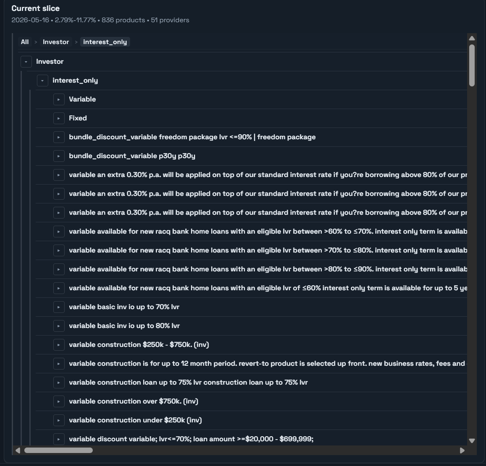

# AR-local Universal Roadmap

This is the shared roadmap for LLM agents working on AR-local. Treat it as the operating contract for changes that affect Pi runtime, dashboard parity, data durability, and ship workflow.

## North Star

AR-local is the LAN-hosted, self-contained local runtime for Australian CDR data. On the Raspberry Pi it must serve the dashboard continuously at:

- `http://<pi-ip>:8808/`
- `http://ar.local:8808/` when local DNS or mDNS is configured for the Pi

The dashboard must use real generated artifacts only, with banking as the current priority. Energy remains secondary unless the user explicitly reopens it.

## Access And Operator Facts

This section is intentionally practical. It should let a future LLM or human operator reconnect to the Pi, identify the live service tree, open the dashboard remotely, and continue development without rediscovering the topology.

### Public, non-secret access facts

- Pi LAN IP: `10.0.0.92`
- Pi Tailscale IP: `100.78.28.10`
- Pi SSH user: `pi`
- Local private key path on the Windows development machine: `%USERPROFILE%\.ssh\pi5`
- Main repo: `https://github.com/yanniedog/AR-local.git`
- AustralianRates shell repo: `https://github.com/yanniedog/australianrates.git`
- Expected local Windows workspace for this repo: `C:\code\AR-local`
- Expected sibling/related Pi checkout root: `/srv/ar-local`

Do not commit private keys, tokens, passwords, `.env` secrets, or the sudo password to this repository. Sudo may require an interactive password supplied by the operator in the current session; use it only when OS package, mount, or systemd changes require root.

### Rediscovering current addresses

The addresses above are the known-good deployment facts at the time this roadmap was written. They are operational facts, not permanent infrastructure guarantees.

- LAN IP drift: check the home router DHCP client/reservation table for host `ar`, then update this file if the reserved address changes.
- Tailscale IP drift: check the Tailscale admin console or local Tailscale client for the Pi node named `ar`, then update `HostName` in `%USERPROFILE%\.ssh\config` if needed.
- Once SSH works, confirm both addresses from the Pi itself:

```sh
hostname -I
```

The Pi should continue to advertise `10.0.0.92` on the LAN and `100.78.28.10` on Tailscale unless the router or Tailscale node identity changes.

### SSH from the Windows development machine

LAN command when on the home network:

```powershell
ssh -i "$env:USERPROFILE\.ssh\pi5" -o HostKeyAlias=10.0.0.92 pi@10.0.0.92
```

Remote command over Tailscale:

```powershell
ssh -i "$env:USERPROFILE\.ssh\pi5" -o HostKeyAlias=10.0.0.92 pi@100.78.28.10
```

Recommended `%USERPROFILE%\.ssh\config` entries:

```sshconfig
Host ar-local-pi5
  HostName 100.78.28.10
  User pi
  IdentityFile ~/.ssh/pi5
  IdentitiesOnly yes
  HostKeyAlias 10.0.0.92

Host ar-local-pi5-dashboard
  HostName 100.78.28.10
  User pi
  IdentityFile ~/.ssh/pi5
  IdentitiesOnly yes
  HostKeyAlias 10.0.0.92
  Compression yes
  ExitOnForwardFailure yes
  LocalForward 127.0.0.1:18808 127.0.0.1:8808
```

Use `HostKeyAlias=10.0.0.92` for the Tailscale address because the known host identity was originally established for the LAN address.

### Remote dashboard access while travelling

Direct Tailscale URL:

```text
http://100.78.28.10:8808/
```

Local browser via SSH tunnel:

```powershell
ssh -N ar-local-pi5-dashboard
```

Then open:

```text
http://127.0.0.1:18808/
```

Use the tunnel when a tool, browser, or test runner needs a local loopback URL. The tunnel maps Windows `127.0.0.1:18808` to the Pi dashboard at `127.0.0.1:8808` and enables SSH compression for large JSON responses.

`ar.local` is a LAN convenience name, not guaranteed over remote Tailscale unless Tailscale DNS, MagicDNS, or a split-DNS rule is explicitly configured and verified. When travelling, prefer the Tailscale IP or the SSH tunnel URL.

## Current Deployed Shape

The current Pi deployment is portable-root based. The systemd service does not run from the old bootstrap checkout under `/home/pi`; it runs from the portable tree:

- authoritative app checkout: `/srv/ar-local/AR-local`
- authoritative AustralianRates shell checkout: `/srv/ar-local/australianrates`
- authoritative durable data root: `/srv/ar-local/data`
- durable run DBs: `/srv/ar-local/data/runs/<date>/_exports/local-cdr.sqlite`
- dashboard service: `ar-local-dashboard.service`
- dashboard bind: `0.0.0.0:8808`

### Authoritative service checkout

Before declaring the Pi updated, run:

```sh
systemctl cat ar-local-dashboard.service
```

Check these fields:

- `WorkingDirectory`: the checkout where `git rev-parse HEAD` must equal `origin/main`.
- `ExecStart`: the Python script path, `--runs` root, `--site-root`, host, and port that the live dashboard actually uses.

Updating `/home/pi/AR-local` alone is not enough if `WorkingDirectory` points at `/srv/ar-local/AR-local`.

## Development Bootstrap

### Local Windows development

Use the local repo for code changes and the Pi for deployed runtime verification:

```powershell
cd C:\code\AR-local
git fetch origin --prune
git checkout main
git pull --ff-only origin main
git checkout -b agent/<clear-slug>
npm install
```

Keep the AustralianRates public shell repo available beside this project when doing dashboard parity work:

```powershell
cd C:\code
git clone https://github.com/yanniedog/australianrates.git
```

If it already exists, update it before parity work:

```powershell
cd C:\code\australianrates
git checkout main
git pull --ff-only origin main
```

Local dashboard launch examples:

```powershell
python cdr_dashboard_server.py --exports latest --runs runs --host 127.0.0.1 --port 8808 --site-root C:\code\australianrates\site --preload
npm run verify:local -- --base-url=http://127.0.0.1:8808/
```

Use real generated artifacts under `runs/<date>/_exports/`; never invent rows or demo JSON to satisfy a dashboard state.

### Pi development and deployment

The Pi should be treated as the deployed `main` runtime, not as a place to carry unmerged feature branches. For ad hoc inspection:

```sh
ssh ar-local-pi5
cd /srv/ar-local/AR-local
git status --short --branch
git rev-parse HEAD
git rev-parse origin/main
```

Expected OS-level tools:

```sh
git --version
python3 --version
node --version
npm --version
gh --version
```

Expected package baseline on a greenfield Pi:

```sh
sudo apt update
sudo apt install -y git python3 nodejs npm gh avahi-daemon
```

Only use sudo for OS package, mount, ownership, and systemd work. The application itself must run as `User=pi`.

### GitHub ship workflow

For any repo change, follow `WORKFLOW.md` end to end:

1. Branch from fresh `origin/main`.
2. Commit and push the topic branch.
3. Open a PR to `main`.
4. Wait for CI.
5. Run `npm run wait-for-bots` and do feedback synthesis.
6. Reply to/close substantive review threads.
7. Squash merge.
8. Update/restart the local/Pi dashboard from merged `main`.
9. Run `npm run verify:local`.

The Pi runtime must end on GitHub `main`. Never leave `/srv/ar-local/AR-local` deployed on an unmerged topic branch.

## Live Pi Observability

Do not wait blindly during Pi work. Keep one command producing live evidence, or poll short status commands while a long task runs.

Useful remote probes:

```powershell
ssh ar-local-pi5 "hostname; hostname -I; date; uptime"
ssh ar-local-pi5 "systemctl is-active ar-local-dashboard.service; systemctl is-enabled ar-local-dashboard.service"
ssh ar-local-pi5 "systemctl status --no-pager ar-local-dashboard.service"
ssh ar-local-pi5 "journalctl -u ar-local-dashboard.service -n 120 --no-pager"
ssh ar-local-pi5 "journalctl -u ar-local-daily.service -n 160 --no-pager"
ssh ar-local-pi5 "ss -ltnp | grep 8808 || true"
ssh ar-local-pi5 "free -h; df -h / /srv/ar-local /dev/shm"
ssh ar-local-pi5 "cd /srv/ar-local/AR-local && git status --short --branch && git rev-parse --short HEAD && git rev-parse --short origin/main"
```

Useful HTTP probes:

```powershell
Invoke-WebRequest -UseBasicParsing -Uri http://100.78.28.10:8808/ -TimeoutSec 20
Invoke-RestMethod -Uri http://100.78.28.10:8808/api/latest -TimeoutSec 20
Invoke-WebRequest -UseBasicParsing -Uri http://127.0.0.1:18808/ -TimeoutSec 20
Invoke-RestMethod -Uri http://127.0.0.1:18808/api/latest -TimeoutSec 20
```

Treat the SSH and HTTP probes in this section as canonical. Later verification sections should reference these probes instead of copying and expanding alternate versions unless a command is materially different.

Large history endpoints can be network-bound over Tailscale even when the Pi serves them quickly locally. If `/api/banks/history` is slow over the remote link, compare the Pi-local timing before assuming the service is stalled:

```powershell
ssh ar-local-pi5 "python3 - <<'PY'
import time, urllib.request
url='http://127.0.0.1:8808/api/banks/history'
t=time.time()
with urllib.request.urlopen(url, timeout=120) as r:
    data=r.read()
print('status=200 bytes=%d time=%.3f' % (len(data), time.time()-t))
PY"
```

For long ingest/export runs, capture service logs continuously:

```sh
journalctl -fu ar-local-daily.service
```

In a second shell, monitor resource and artifact movement:

```sh
watch -n 5 'date; free -h; df -h /srv/ar-local /dev/shm; find /srv/ar-local/data/runs -maxdepth 3 -type f -name "local-cdr.sqlite" | sort | tail'
```

## Non-Negotiables

- Work from fresh `origin/main` on a distinct branch.
- Follow `WORKFLOW.md` before opening or merging any PR.
- Keep the Pi deployed copy equal to GitHub `main`; no unmerged topic branch is a deployed runtime.
- Keep generated artifacts indefinitely unless the user explicitly changes retention.
- Use RAM-backed staging for high-churn ingest/build work on the Pi, then atomically copy completed `_exports` into durable storage.
- Use AustralianRates `site/` assets and ribbon builders as the canonical dashboard source. Do not fork public hierarchy labels, tier ordering, or node semantics into AR-local unless the public site exposes no equivalent.
- Acceptance uses local dashboard verification, not Cloudflare or `www.australianrates.com.au`.

## Portable Runtime Model

The portable root is the single tree that can move from microSD to USB SSD or Pi 5 SSD HAT storage:

```text
/srv/ar-local/
  AR-local/
  australianrates/
  data/
    runs/<date>/_exports/
    state/
```

Services must be rendered against this portable root and must not bake in microSD-specific paths. To migrate to SSD:

1. Stop `ar-local-dashboard.service` and `ar-local-daily.timer`.
2. Copy `/srv/ar-local` to the SSD mount with ownership and permissions preserved.
3. Mount the SSD at `/srv/ar-local`, or reinstall the units with the SSD path as the portable root.
4. Start the timer and dashboard service.
5. Verify `git rev-parse HEAD` equals `origin/main` and run `npm run verify:local -- --base-url=http://127.0.0.1:8808/`.

If a separate `/home/pi/AR-local` checkout exists, treat it as a bootstrap/admin convenience unless the authoritative service checkout proves the installed unit is using it.

## LAN Availability

The dashboard server must bind to `0.0.0.0` on port `8808` for Pi service use and for manual LAN launches. All browser assets and API calls must remain same-origin relative URLs so every PC on the LAN can load the dashboard from the Pi IP address.

Pi setup should also provide a stable LAN name:

- Preferred: router DHCP reservation for the Pi MAC address to keep the current fixed IP.
- `ar.local`: use Avahi/mDNS or a router DNS override pointing `ar.local` to the Pi IP.
- Verification: from another PC, open `http://<pi-ip>:8808/` and `http://ar.local:8808/api/latest`.

Remote note: `.local` mDNS names usually do not traverse Tailscale by default. This is not a dashboard failure if `http://100.78.28.10:8808/` or the SSH tunnel works while travelling.

## Dashboard Parity

Parity means the local dashboard uses the same public shell, branding, hierarchy taxonomy, compact node labels, tier ordering, and ribbon behavior as AustralianRates.

Current source of truth:

- Static public shell: sibling `australianrates/site/`
- Ribbon formatting: `/site/ar-ribbon-format.js`
- Ribbon tree construction: `/site/ar-ribbon-tree.js`
- Local row adapter: `dashboard/cdr-ribbon-map.js`
- Local hierarchy renderer: `dashboard/hierarchy.js`

Rules for future agents:

- Prefer `window.AR.ribbon.ribbonInitialTierFieldsForSection()` (or `ribbonTierFieldsForSection`) and `buildRibbonTierTree()` for visible banking hierarchy.
- Deferred locally: full `ar-filters.js` bar, Tabulator table, and `chartReportPlot` CPI stack (see parity audit).
- Keep `dashboard/cdr-taxonomy-tree.js` as fallback or diagnostic support, not the primary visible banking tree.
- When public AustralianRates changes hierarchy fields or labels, update the local row adapter and verify identical node lists against the public asset behavior.
- Do not invent local display names for canonical public nodes.
- Preserve valid accessibility attributes; branch rows use `aria-expanded="true"` or `"false"`.

## Historical Ribbon Values

The ribbon must surface historical banking values from retained SQLite exports. The server exposes `/api/banks/history`, built from the latest retained `runs/*/_exports/local-cdr.sqlite` files, and the client indexes historical rows by dataset and product identity. The HTTP payload is intentionally bounded to a recent run window while the artifacts themselves remain retained indefinitely.

Current implemented behavior:

- `dashboard/app.js` loads `/api/banks/history`, normalizes retained rows once, and indexes them by dataset/product identity.
- `dashboard/chart.js` renders the banking chart from a `bank-history` model using retained run dates.
- The dashboard exposes `30D`, `90D`, `180D`, `1Y`, and `All` history windows.
- The right-hand `Current slice` panel remains based on the AustralianRates ribbon tree for the current visible slice.
- Hierarchy rows show prior/latest history deltas when at least two retained run dates exist for the matching products.
- With only one retained run, a single-date ribbon/point column is expected. Do not fabricate a second date to make the chart look historical.

A retained run date is a valid `YYYY-MM-DD` child directory under the active service `--runs` root that contains `_exports/local-cdr.sqlite`; for the portable Pi service this is normally `/srv/ar-local/data/runs/<date>/_exports/local-cdr.sqlite`. New greenfield installs may legitimately have one retained run until daily automation accumulates more.

Future improvements should:

- Keep history reads in memory where practical; avoid repeated microSD churn.
- Prefer compact history payloads over shipping full `details_json`.
- Extend hierarchy history only through public tier semantics; do not fork local node meanings.
- Verify at least two retained runs when changing historical display logic where practical, but accept a one-run Pi as an initial greenfield state.

## Banks-First Work Queue

1. Keep banking ingest/export healthy on Pi.
2. Keep `Mortgage`, `Savings`, and `TD` dashboard sections parity-aligned with AustralianRates.
3. Keep historical ribbon values populated from retained DB exports.
4. Keep LAN access stable on Pi IP and `ar.local`.
5. Keep SSD portability documentation and systemd unit rendering current.
6. Only revisit Energy after the user explicitly asks.

## Verification Checklist

Before PR:

```sh
python -m py_compile cdr_dashboard_server.py cdr_outputs.py cdr_daily.py pi_daily_sync.py
node --check dashboard/app.js
node --check dashboard/chart.js
npm run verify:local -- --base-url=http://127.0.0.1:<port>/
```

For dashboard UI changes, use Browser MCP or an equivalent real browser check against the running local dashboard. Confirm the chart, history-window controls, provider logos, and `Current slice` hierarchy render together.

On Pi after merge/setup:

```sh
# First identify the authoritative service checkout and --runs root.
systemctl cat ar-local-dashboard.service
cd /srv/ar-local/AR-local
git rev-parse HEAD
git rev-parse origin/main
node --version
npm --version
gh --version
python3 --version
git --version
systemctl status ar-local-dashboard.service
systemctl status ar-local-daily.timer
npm run verify:local -- --base-url=http://127.0.0.1:8808/
curl -fsS http://127.0.0.1:8808/api/latest
curl -fsS http://127.0.0.1:8808/api/banks/history
```

The `HEAD` check must be run in the authoritative service checkout, normally `/srv/ar-local/AR-local`.

From another LAN PC:

```sh
curl -fsS http://<pi-ip>:8808/api/latest
curl -fsS http://ar.local:8808/api/latest
```

From a remote PC over Tailscale:

```sh
curl -fsS http://100.78.28.10:8808/api/latest
ssh -N ar-local-pi5-dashboard
curl -fsS http://127.0.0.1:18808/api/latest
```

## Handoff Discipline

Every agent should leave the next agent with:

- Branch name and PR URL.
- Exact commands run and failures, if any.
- Whether Pi deployment was updated to GitHub `main`.
- Which Pi checkout the service is using, from the authoritative service checkout check.
- Current dashboard URLs and verification results: LAN IP, `ar.local`, Tailscale IP, and SSH tunnel if relevant.
- Current retained history run count from `/api/banks/history`.
- Any parity gap deliberately deferred.
- Whether any access assumptions are unverified, especially DNS, SSH aliases, or the active systemd unit path.